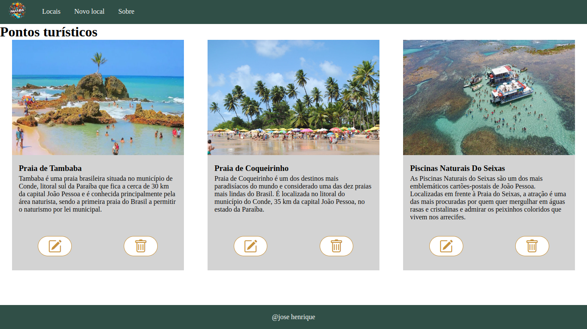

# Guia Turístico



> Guia Turístico sobre as belezas da Paraíba.


## 💻 Pré-requisitos

Antes de começar, verifique se você atendeu aos seguintes requisitos:

* Você instalou a versão mais recente de `Node`.
* Você tem o `Vscode`, com a extensão `Live Server`.
* Breve conhecimento no `Live Server`.

## 🚀 Instalando Guia Turístico

Para instalar o Guia Turístico, siga estas etapas na raiz do projeto:

```
npm i
```


## ☕ Usando Guia Turístico

Para usar Guia Turístico, siga estas etapas:

```
npm start
```

Por fim, abra o index.html usando o Live Server.


## 🤝 Colaboradores


<table>
  <tr>
    <td align="center">
      <a href="#">
        <br>
        <sub>
          <b>José Henrique</b>
        </sub>
      </a>
    </td>
  </tr>
</table>


## 📝 Licença

Esse projeto está sob licença. Veja o arquivo [LICENÇA](LICENSE.md) para mais detalhes.